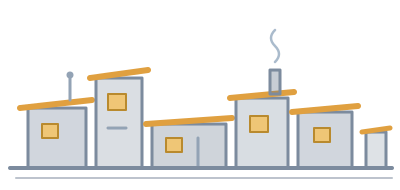

<div align="center">



```
                          .-.                    .--.
             .--.        /   \      .-.          |[]|    .-.
            /::::\   .--|:::::|--. /   \    .--. |  |   /   \
      .-.   |::[]:|  |==|:::::|==| |:::|   /::::\|[]|  |:::::|   .--.
     /   \  |::::||  |  |[]:[]|  | |:::|   |::::||  |  |:::::|  /    \
    |:::::| |[]::||  |  |:::::|  | |:[]|   |[]::||::|  |:[]:[|  |::[]|
    |:[]:[| |::::||__|__|:::::|__|_|:::|___|::::||::|__|:::::|__|::::|
   _|_____|_|____||__|__|_____|__|_|___|___|____||__|__|_____|__|____|_
  ///////////////////////////////////////////////////////////////////////

                          s h a n t y t o w n
              a crew of agents, and someone running the town.
```

# shantytown

**A small harness for running a crew of coding agents.**

*Create a work item. Tell an agent to go get it. That's the whole idea.*

[](#-measured-against-gas-town)
[](#-the-whole-surface)
[](#-principles)
[](#-install)
[](#-install)
[](LICENSE)

</div>

```bash
st task "fix the login timeout"      # → st-1
st inbox ada "go read st-1"           # → straight into ada's pane
st crew                              # → who's up, who's on what
```

Three steps: **create → send → fetch.** No daemon. No broker. No queue — just a
thin harness plus an orchestration layer that prioritizes work and reacts to
governed events (see [Workflows & events](#-workflows--events)).

> **Where this came from.** Shantytown was written by someone who runs a
> [Gas Town](https://github.com/gastownhall/gastown) fleet daily — it is not a rival pitch from
> outside, it is the smaller thing that fell out of operating one. Gas Town is built for a world
> with an orchestration tier. Some days the job is just *"give that agent this ticket"*, and on
> those days a whole town is more than the work needs. This is what's left when you keep only that.

## 🖥️ See It In Action

Create work and hand it to an agent. The id is the product — it's what step two has to say.

```text
$ st task "fix the login timeout"
  st-1    fix the login timeout

$ st go st-1 ada
  st-1 -> ada          in progress
  sent to pane crew-ada
```

Every writing command has a `--dry-run`, and dispatch shows you triage's verdict before it commits
to anything:

```text
$ st go st-1 ada --dry-run
  would: tracker.update(st-1, status=in_progress, assignee=ada)
  would: send-keys -> pane crew-ada
  would NOT: create a convoy, spawn a session, wait for ack

  triage: NUDGE    healthy
         inputs: context_high=False context_k=None pane='crew-ada' screen_lines=24
  0 writes. 1 tracker call, 1 send-keys.
```

When the agent is mid-task, `st go` **refuses** rather than typing over its work — and it shows you
the input it judged on, so you can disagree with it:

```text
$ st go st-2 ada
  refused: pane not ready — REFUSE   in-flight work
         inputs: marker='esc to interrupt' pane='crew-ada'
$ echo $?
1
```

`st crew` answers the only question a dispatcher actually has — *who can take the next item?*

```text
$ st crew

  ada         worker         up       current  idle    crew-ada
  bo          worker         up       current  busy    crew-bo
  cy          lead           up       stale    idle    crew-cy
  di          worker         down     —        —       crew-di

  2 free: ada, cy
  1 busy: bo

  ⚠ 1 agent(s) are running settings OLDER than the file on disk: cy
    Their hooks are whatever the file said AT LAUNCH. Rewriting a settings file is not deploying it — only a relaunch
    (`st stop <agent> && st new <agent>`) re-reads it.
```

And every session starts from the anchor — identity, one item, and where your stop events go:

```text
$ st anchor ada

  You are ada — worker, reports to cy.

  ON YOUR PLATE
    ▶ st-1  fix the login timeout        (in_progress)

  YOUR LEAD
    cy (lead) — up. Your stop events go to them.
```

A message to an agent that isn't there is **never** reported as delivered:

```text
$ st inbox di "protocol step 3"
  could not tell: pane crew-di is not there (agent down?)
$ echo $?
2
```

## 🤔 Why Shantytown?

Be honest about the alternatives first, because two of them are good.

**Raw tmux and a few shell scripts** is genuinely the right answer for one or two agents. Everything
here started as that. What it never grows on its own is a memory of *what state a pane is in* before
you type into it.

**[Gas Town](https://github.com/gastownhall/gastown)** is the serious tool in this space, and it
earned its size honestly: a mayor, a deacon, convoys, formulas, quotas, scheduling — a real
orchestration tier for running a real fleet. If you want a town, use the town. Shantytown does not
try to replace any of that and never will.

Shantytown's whole claim is *smallness*: stdlib-only Python, no daemon, no server, no background
process, and a tracker you can swap in two functions.

|  | **raw tmux + shell scripts** | **[Gas Town](https://github.com/gastownhall/gastown)** | **shantytown** |
|--|:---:|:---:|:---:|
| Dispatch work into an agent's pane | ✅ | ✅ | ✅ |
| Agent identity, roles, hierarchy | ❌ | ✅ | ✅ |
| Stop events routed up a tier | ❌ | ✅ | ✅ |
| Orchestration tier (mayor, deacon, convoys, formulas) | ❌ | ✅ | ❌ *by design* |
| Scheduling, quotas, fleet-scale ops | ❌ | ✅ | ❌ |
| Refuses to type into a busy pane | ❌ | ❌ | ✅ |
| Pluggable work tracker (files, beads, yours) | ❌ | ❌ *beads* | ✅ |
| Runs with no daemon or background service | ✅ | ❌ | ✅ |
| No database or data plane to stand up | ✅ | ❌ *Dolt* | ✅ |
| Third-party runtime dependencies | none | Dolt | **none** |

The two ❌s in shantytown's column are the point, not an omission. If it grows an orchestration tier,
we got it wrong.

*Two rows deserve their sources. "Refuses to type into a busy pane": `gt nudge --mode immediate`
says of itself, in its own help text, "Send directly via `tmux send-keys`. Interrupts in-flight
work." "No data plane": measured — a single `gt sling --dry-run` opened 63 sequential Dolt
connections on our host. Everything else in the Gas Town column is from its own documented feature
set; if we have any of it wrong, open an issue and we'll fix the table.*

## ⚡ Measured against Gas Town

The project had a gate: *time it against `gt sling`, and if it isn't dramatically faster, say so and
stop.* Here is what the gate measured.

| | `gt sling` | `st go` | |
|---|---:|---:|---|
| Commands | ~110 | **19** | *a small, deliberate fraction of the surface, by measured use* |
| dispatch (dry-run) | 51.54 s | **0.15 s** | **~344× faster** |
| dispatch (real) | > 120 s ⏱️ | **3.40 s** | **≥35× faster** |
| Dolt connections | 63 | **3** | **21× fewer** |

**Method, so you can argue with it:** one host, one data plane, one beads store, same day. `gt sling`
was timed twice and exceeded a 120-second timeout both times, so **≥35× is a floor, not a
measurement** of its true cost. Of `st go`'s 3.4 s, essentially all of it is the tracker's own
`bd update` write — shantytown's own overhead is ~0.2 s. The command-usage figure is shell history
plus every script on one fleet. Full write-up in [`docs/vision.md`](docs/vision.md) and
[`docs/design.md`](docs/design.md); numbers on your fleet will differ.

## ✨ Features

- 🛖 **A town with no town hall.** No daemon, no broker, no message bus, no scheduler. `st` is a
  process that runs, does one thing, and exits.
- 📮 **`st inbox` *is* `tmux send-keys`.** Nothing sits between you and the agent — which is exactly
  why an undeliverable message can't be quietly queued and reported as sent.
- 📋 **`st task` gives you an id.** Create work, get `st-1` back. That id is the whole reason step
  two has anything to say.
- 🎯 **`st go` is the one that matters.** Bind an item to an agent, tell them, confirm it landed,
  *then* record it. In that order, on purpose.
- 🚦 **Triage before every dispatch.** Refuse · nudge · clear · restart, judged from what the runtime
  actually prints on screen. Not a command you remember to run — `st go` consults it and refuses
  rather than interrupt a working agent.
- 🧭 **`st anchor` is a pure read.** Who you are, the one item on your plate, and whether the agent
  your stop events route to is actually up. It never writes, and a test asserts that against the
  filesystem rather than trusting the docstring.
- 👥 **`st crew` reports work, not just liveness.** `up` is a launch fact; an agent three hours into
  a refactor and one sitting at an empty prompt both print `up`. The work column tells them apart.
- 🔀 **Stop events route up a tier.** worker → lead → administrator. A lead absorbs what it can and
  escalates what it can't; an orphan is told, loudly, that its events go nowhere.
- 🔌 **Pluggable trackers.** A tracker is two functions. Files today, beads tomorrow, yours next —
  *same dispatch code*, proven by a swap test rather than by an interface.
- 🖥️ **tmux-native, socket-aware.** Bring your own panes. Named sockets are first-class, because bare
  tmux cannot see them and will confidently report every live agent as down.
- 🧪 **`--dry-run` on every writing command**, from commit one.
- 🔢 **Exit codes a script can branch on** — `0` did it · `1` refused · `2` couldn't tell. *Couldn't
  tell* is a first-class answer, never rounded up to success.

## 📮 Routing: there is nothing in the middle

**`st inbox` *is* `tmux send-keys`.** That's not an implementation detail — it's the product.

```
st inbox ada "go read st-1"
   │
   ├─ registry.get("ada")        → identity: role, reports_to, pane
   ├─ pane = "crew-ada"          → the address IS the pane
   ├─ panes.exists(pane)?        → NO  → exit 2 "could not tell". nothing sent.
   └─ tmux send-keys -t <pane>   → the message. that's the delivery.
```

**No message bus. No queue. No delivery guarantee — because there's nothing to guarantee.** The pane
is either there or it isn't, and you're told which.

| routing outcome | exit | what it means |
|---|---|---|
| delivered | **0** | the keys went into a live pane |
| no such agent / no pane | **1** | refused. nothing sent. |
| pane named but gone | **2** | *could not tell* — never a cheerful success |

For the messages that must survive a dead recipient — a handoff, a protocol step — `--durable`
persists to the tracker **first** and only then attempts the live send, so the recipient picks it up
on their next anchor.

**Identity resolves through the registry, not through a config file you hand-edit.** The graph is the
truth; the agent card is a projection of it. Writes go to the graph, reads may come from the card,
never the reverse — so an agent's address can't quietly drift from reality.

## 🧱 The whole surface

```
st task <title>                   create work, get an id back
st inbox <agent> <message>         a message into a pane. send-keys, nothing more.
st go <item> [agent]              dispatch. the one that matters.
st anchor                          who am I, what's on my plate      ← the anchor
st crew                           who exists, what state, what role
st roles [--check]                the hierarchy, and whether it's real
st role set <agent> <role>        generative: rewrites cards, emits hooks
st new <agent>                    create an agent from a card
st stop <agent>                   stop it
st log [agent]                    what happened
st context <query>                what code should I be looking at?
st doctor [--install]             what's installed, what's stale, what's missing
st project                        materialize the crew cards FROM the graph
st tend                           supervise the crew: respawn what DIED, never what was RETIRED
st attach <agent>                 attach to a crew member by name (socket + pane resolved; via shanty)
st dashboard [admin]              live, tier-scoped view: roster/state/work, self-refreshing
st subscribe                      watch quipu entity events; route governed workflows to the admin
st worktree <repo> [agent]        provision an agent's isolated worktree off a SHARED project repo
st stats [agent]                  what the crew actually did: files, skills, tokens (local store)
```

Nineteen, and the count is load-bearing: a test pins this block to the parser, so the next command
either updates the list or fails CI.

## 🔀 Workflows & events

Shantytown doesn't just dispatch — it **prioritizes** and **reacts**.

- **Prioritized workflows.** At the administrator's stop, the drain composes a
  ranked workflow from fleet state — a stopped worker to re-dispatch, an idle
  worker to give work, an escalation to decide — and injects it straight into the
  admin's terminal. Blast-radius weighting (via Hank) is opt-in; it runs with no
  backend at all.
- **Governed events.** Shantytown subscribes to Quipu entity events — a governed
  `aegis:Workflow` required by a code change, a policy effect, a doc gone stale —
  and acts on them: creating and dispatching work, or routing it to the admin
  (`st subscribe`).

The administrator is a real coordinator: it may assign and dispatch autonomously,
not just advise.

## 🧭 Where this fits

- **Use Gas Town** when you want the tier — convoys, formulas, scheduling, quotas, a mayor
  coordinating work you did not personally hand out. It does things shantytown does not attempt.
- **Use raw tmux** when you have one or two agents and dispatch is something you do by hand anyway.
  Honestly, that's fine.
- **Use shantytown** when you have a handful of agents, you want *create → send → fetch* and nothing
  else, and you would rather add a tracker than run a daemon.
- **Use both.** Nothing here conflicts with Gas Town — shantytown talks to panes and a tracker, so it
  can sit beside a fleet rather than in front of one.

## 📦 Install

```bash
git clone https://github.com/scbrown/shantytown && cd shantytown
pip install -e .
st anchor
```

Python 3.11+ and `tmux`. No third-party dependencies. A tracker backend (Beads) is optional — the
files tracker needs nothing at all.

```bash
st doctor            # what's installed, what's stale, what's missing
```

### Configuration

Everything optional is an environment variable, and every default is local. Nothing here needs to be
set to run the harness on the files tracker.

| variable | what it points at | default |
|---|---|---|
| `SHANTY_ROOT` | **which store `st` reads and writes** — the single most consequential setting. Precedence: `--root` > `$SHANTY_ROOT` > `cwd/.shanty`, and the CLI and the Stop hook resolve it identically. If it is unset and you run `st` from a directory with no `.shanty`, `st` operates on an empty store — not the fleet's. | `./.shanty` |
| `SHANTY_AGENT` | who you are, so `st anchor` needs no argument | — |
| `SHANTY_TMUX_SOCKET` | the named tmux server your agents live on. **The store's `settings/tmux-socket` file wins over this** — a socket declared in the store is read from there, not from your shell's ambient env, so the answer cannot change with which pane you ran `st` from. | bare tmux |
| `SHANTY_BASH_GUARD` | a command emitted as a PreToolUse Bash hook in every role's settings — the deployment's host-policy guard (e.g. blocking another orchestrator's start verbs on a shared host). Claude Code contract: exit 2 blocks, else allows. Unset = no hook emitted; shantytown ships no guard and hardcodes no path. | — |
| `SHANTY_STALL_MIN` | minutes an idle worker may hold an in_progress item with zero pane/item/shell change before tend flags it STALLED to the coordinator. Default 15 — ~30 consecutive unchanged 30s passes: far above prompt-render lag, far below the measured hours-long parked failure. | `15` |
| `SHANTY_DARK_AGENTS` | names (space/comma-separated) Rule Zero and tend must never count feedable — panes another orchestrator keeps respawning with this deployment's worker settings, which carry the stop-event wiring but route nothing here. The launch-stamp ownership gate excludes unstamped agents structurally; this list is the explicit override/belt for named ghosts. | the gastown-dark crew |
| `QUIPU_SERVER` | quipu, for `--registry quipu`, `st project`, or `st subscribe` | `http://localhost:3030` |
| `SHANTY_ONTO_NS` | the ontology IRI base your graph is keyed under | `http://shantytown.example/ontology/` |
| `BOBBIN_SERVER` | bobbin, for `st context` | `http://localhost:8080` |
| `SHANTY_RANKER` | `policy` to weight the admin workflow by Hank blast radius; else rule-based | — |
| `SHANTY_FORGEJO_URL` | a self-hosted forge: `st doctor`'s release checks, and the base URL for `--backend forgejo` (issues as work items; pair with `SHANTY_FORGEJO_TOKEN` and `--repo owner/name`) | `http://localhost:3000` |
| `SHANTY_FORGEJO_TOKEN` | API token for `--backend forgejo` (issue read/write on the repo) | — |
| `SHANTY_REACTOR_URL` | reactor, if you use it as an event source | `http://localhost:8075` |
| `SHANTY_CANONICAL_SOURCE` | the checkout a fleet deploy must be built from, for `st doctor`'s self-check. Unset and not in a git checkout → the check is `CANNOT_TELL`, never OK. | the MAIN working tree of the running package's checkout (a linked worktree resolves to its primary, never itself) |

⚠️ **`SHANTY_ONTO_NS` is data identity, not cosmetics.** Every triple in a graph is keyed under it.
Pick one per graph, set it before the first write, and never change it — repointing it does not
error, it just stops new facts from joining the old ones.

## 📚 Docs

| doc | what it answers |
|---|---|
| [`docs/vision.md`](docs/vision.md) | what this replaces, and how we'll know it failed |
| [`docs/design.md`](docs/design.md) | the shape: dispatch, triage, trackers, panes |
| [`docs/cli.md`](docs/cli.md) | the sixteen commands, and the anchor |
| [`docs/agent-card.md`](docs/agent-card.md) | identity — the graph is the truth, the card is a projection |
| [`docs/roles.md`](docs/roles.md) | worker / lead / administrator, and why a lead absorbs |
| [`docs/adapters.md`](docs/adapters.md) | first-class defaults, pluggable everything |
| [`docs/integrations.md`](docs/integrations.md) | the rest of the toolbox — and why we ship no dashboard |

## 🧭 Principles

- **Lean, not absent.** Orchestration is welcome — prioritization and event reactions — but it stays small: no convoys, no bus, no daemon zoo.
- **Bring your own tracker.** Beads, GitHub issues, or a directory of markdown files. Two functions.
- **Ship no dashboard.** A dashboard reads the tracker, not the harness.
- **Bring your own panes.** [herdr](https://github.com/ogulcancelik/herdr), your own tmux wrapper, or
  bare tmux.
- **A check must be able to fail.** Anything that reports health must be shown returning red. 325
  tests, and the ones that matter most are the ones proving a check *can* say no.

## 📄 Licence

MIT — see [LICENSE](LICENSE).

---

<div align="center"><sub>
Every number here was measured on one host, not estimated.<br>
<i>A crew of agents, and someone running the town.</i>
</sub></div>
